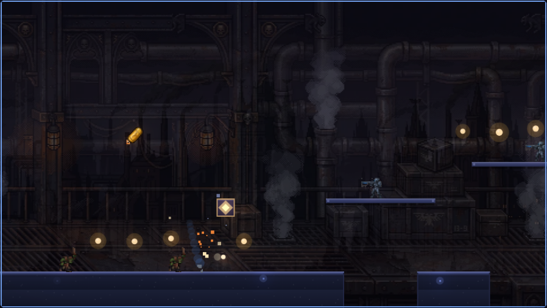

# Purge Protocol

A five-player co-op run-and-gun that runs in a browser tab, plays over a LAN or a
WireGuard tunnel, and ships as a single HTML file.

Run right, shoot everything, die a lot, do it with four friends. Deterministic lockstep
netcode, a stdlib-only relay, levels that are proven completable before they can ship,
and a 16-bit pixel cast — all in one `orbit.html` you can open from disk.



> **Unofficial fan work.** The art here is grimdark science fiction made for this
> project, in the spirit of tabletop wargames — most obviously *Warhammer 40,000*,
> which is a trademark of **Games Workshop Ltd**. This project is not official, not
> endorsed by and not affiliated with Games Workshop, and no Games Workshop assets are
> included. It is free, non-commercial, MIT-licensed hobby code. If Games Workshop
> would rather it did not exist in this form, say so and it comes down.
>
> No assets from any commercial video game are included either. The repository is named
> `orbit-assault` for historical reasons; the game is *Purge Protocol*.

## What it is

- **One file to serve.** `build.py` inlines every module, level and sprite sheet into
  `orbit.html`. No bundler, no dependencies, no build step beyond Python 3.
- **Deterministic lockstep netcode.** Only input bytes cross the wire, never game state.
  Every browser runs the identical simulation from the same seed, at a fixed 1/60 tick.
- **Mid-run join.** The relay records the input log, so a latecomer replays it, catches
  up, and takes a slot at an agreed tick. No state transfer, no rollback.
- **A stdlib-only relay.** `relay.py` speaks raw RFC 6455 WebSocket, and serves a live
  dashboard on the same port. Nothing to `pip install`.
- **Levels that are proven playable before they ship.** `verify_level.py` simulates the
  real player physics and refuses to build a level whose goal cannot be reached.
- **It scales itself to the machine.** Three quality tiers, picked from measured frame
  rate and applied to canvas scale and lighting quality, so a laptop and a desktop can
  sit in the same lobby.

## Play it

```
python3 build.py            # verify levels, inline everything -> orbit.html
python3 shotserver.py       # http://127.0.0.1:8901/orbit.html
```

For co-op, on the machine everyone can reach:

```
python3 shotserver.py --bind 0.0.0.0         # the page,  port 8901
python3 relay.py --bind 0.0.0.0 --port 8902  # the relay, port 8902
```

Everyone opens `http://<host>:8901/orbit.html` and points the relay box at
`ws://<host>:8902`. One person presses **Host** and reads out the four-letter room code,
the rest **Join**, the host presses **Launch**. The dashboard at `http://<host>:8902/`
shows who is in, their latency, and their current tick.

Over the internet it wants a flat network rather than port forwarding. A WireGuard hub
works well — every player a peer on one subnet — but any VPN that gives everyone a
routable address to the host will do.

Controls: arrows move, space jumps, X or K fires, up aims up, down aims down in the air
and goes prone on the ground, down plus jump drops through a platform, C throws a bomb,
shift runs, escape pauses, M mutes. Gamepads and touch work too.

## How the netcode works

Each client sends one input byte per tick, a few ticks ahead of the tick it belongs to.
A client only advances the simulation once it holds every player's byte for that tick.
Because the simulation is deterministic, every browser reaches the same state without
ever exchanging positions or health.

Three rules make that hold, and breaking any one of them causes a desync that is
invisible until it is enormous:

1. **No wall-clock, no `Math.random`, no `Date` in simulation code.** All randomness goes
   through a seeded generator. Cosmetic randomness is deterministic noise from position.
2. **One byte per tick, ever.** Re-sending a changed byte for a tick a peer already
   consumed is a race the peer loses.
3. **A stalled client keeps sending inputs.** Sending only while advancing means one
   hitch starves every peer, which stalls them, which starves everyone: a room that can
   never recover.

Input delay adapts to measured latency at launch and climbs if the line degrades, so the
same build works on a wired LAN and through a VPN hop.

Five slots are simulated from tick zero. Unclaimed slots are dormant: frozen, invisible,
ignored by the camera and by every enemy, input pinned to zero. A join is therefore just
an activation at an agreed tick, which is what makes mid-run joining tractable at all.

**Everything you can see is outside the simulation.** Sprites, particles, lighting,
parallax, screen shake and the quality tier are all presentation: two peers can run at
different frame rates, different canvas scales and different visual quality and still
agree on every byte of game state. That separation is the reason the tiers are safe.

## Layout

| path | what |
|---|---|
| `orbit.src.html` | the core: simulation, players, bullets, camera, HUD, lobby, loop |
| `contra.js` | enemies: runners, snipers, turrets, spawners, weapon pods, the wall boss |
| `net.js` | lobby, input exchange, input-log replay for mid-run joins |
| `input.js` | keyboard, gamepad and touch, merged into the one input byte |
| `relay.py` | the WebSocket relay, input recorder, and dashboard |
| `juice.js` `cosmos.js` `light.js` | audio and particles, parallax background, 2D lighting |
| `contra1..3.txt` | levels, as plain ASCII maps |
| `verify_level.py` | proves a level is completable before it may ship |
| `sprites/out/` | packed sprite strips and stage backgrounds, inlined at build time |
| `sprites/prep.py` | turns raw character renders into those strips (the raw renders are not in the repo — they are large, and the packed output is what the game uses) |
| `build.py` | inlines everything into `orbit.html` |
| `tools/chr_rip.py` | decodes NES 2bpp tile data to PNG sheets, for studying tile art |

Levels are ASCII. `.` empty, `#` solid, `=` one-way platform, `^` spike, `o` pickup,
`?` light block, `r` runner, `s` sniper, `t` turret, `S` spawner, `W` weapon pod,
`B` boss, `P` spawn, `F` goal.

## Tests

```
node test_contra.js        # enemies, boss, and same-seed determinism
node test_net.js           # relay + client, including mid-run join and drop/retake
python3 test_relay_frames.py
python3 drive.py           # headless Chrome: solo smoke run, screenshots, console errors
python3 drive_coop.py      # two browsers through a relay, per-tick fingerprint comparison
python3 drive_weapons.py   # weapon pickups, projectile pool cap, stage backgrounds
python3 drive_bomb.py      # bombs: edge trigger, pool reuse, blast, refill
python3 drive_tier.py      # auto-quality: thresholds, application, CPU-throttled probe
python3 drive_anim.py      # walk cycle and aim poses: which sheet each input picks
python3 drive_boss.py 231  # warp to a column and fight the boss
```

`drive_coop.py` is the one that matters: it runs two real browsers against a real relay
and compares a fingerprint of the simulation on every sampled tick. A single mismatch
means the lockstep contract is broken somewhere, and nothing else will show you.

## Forking it

`CONTRACT.md` is the contract every module was written against, including the
determinism rules. Read it before changing anything that runs inside a tick — the rules
in it are not style preferences, they are the reason multiplayer works at all.

The interesting seams:

- **`contra.js` is a self-contained bestiary** behind a four-function interface, so a
  completely different set of enemies drops in without touching the core.
- **Levels are text files.** Draw one, run `verify_level.py`, ship it.
- **Sprites are optional.** Every figure has a canvas-drawn fallback that still runs if
  no sheet loads, so you can replace the whole cast — or none of it — and the game works.
- **`input.js` owns every input device** and emits one byte, so adding a control scheme
  never touches the simulation.

`tools/chr_rip.py` reads a ROM you supply and writes tile sheets for reference. No ROM
and no ripped artwork is included in this repository, and none should be added.

## Licence

MIT, see LICENCE. The code and the art in this repository are original work; see the
fan-work notice at the top regarding the setting that inspired it.
